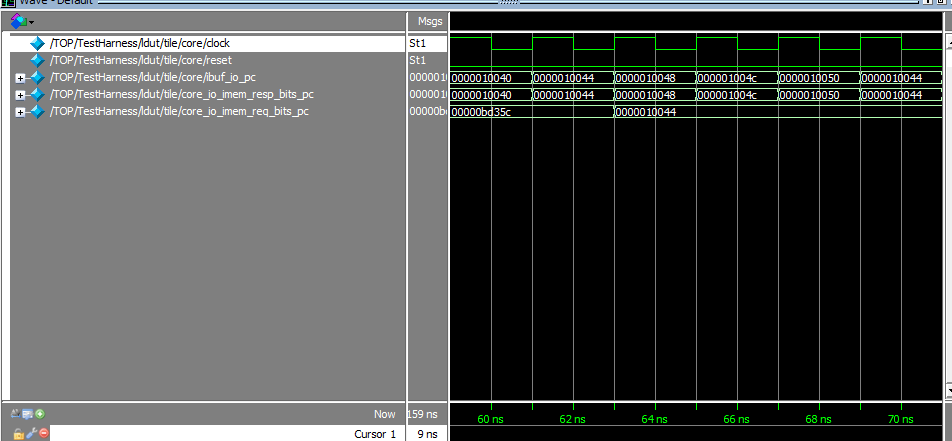
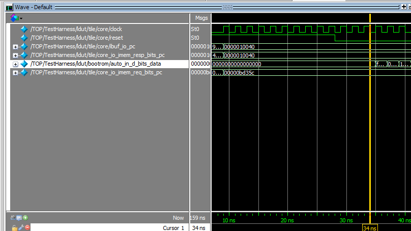
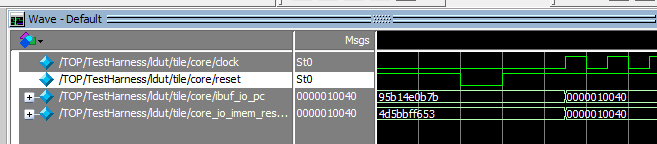

1.  tile的core_io_imem_resp_bits_pc和core_io_imem_req_bits_pc按照字面意思应该是对icache的回复和请求pc,为什么req的pc变得比resp慢？    
  
2.从下图可以看出，core_io_imem_resp_bits_pc变成0x10040后，又经过一些周期，reset变为0， 然后bootrom就开始传出0x10040处的指令数据，这个resp的作用似乎更像是请求的pc?  
  
3.freedom被复位到0x10000,单独的rocket chip却被复位到0x10040，但是看了freedom的rocket chip代码，bootrom也是被复位到0x10040，而现在却被复位到了0x10000，很奇怪?  
  
