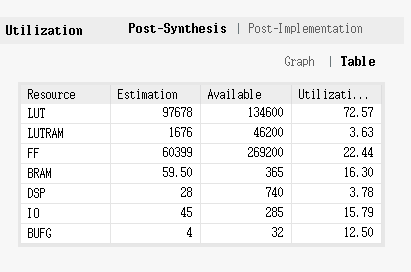
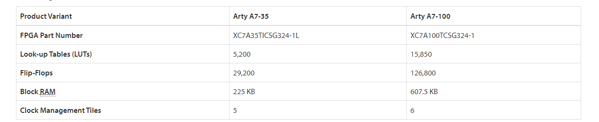

## 进展记录  
- 5-1  
  尝试增加AXI4接口的RAM。  
  (1) 对verilog代码进行修改看能否添加成功，通过脚本将包含所有module的大文件切割成若干个module.v文件，方便进行代码的查找和修改。在实际操作过程中，先尝试把E310自带的的tilelink接口的maskrom转成axi4接口的RAM，找到rocket chip中tilelink转axi4模块的verilog代码， 想移植到E310中，移植中发现找到的tl2axi4模块代码并不是规整的，即该模块的axi4接口不包含完整的AXI4接口信号，这导致从Verilog角度实现该功能难度很大。  
  (2) 尝试阅读，修改chisel代码来实现功能，来发现耦合性极高，需要对chisel级别的代码有透彻的了解才能够修改chisel代码。  
  (3) 总结：今日无具体进展，但对硬件实现的难度有了一定了解
  
- 5-4
  阅读freedom中i2c代码，希望弄明白chisel级别代码，在chisel级别添加axi4

- 5-18  
  张亮：蜂鸟添加crossbar,将一个axi4-lite转为两个axi4-lite，添加两个ram，都能够正常工作。继续尝试添加  mig，发现mig只有axi4接口，没有axi4-lite接口，所以需要解决使用axi4接口不能从ram读数据问题。 
  
- 5-19  
  张亮：在尝试axi4接口过程发现当使用axi4-lite接口时，如果ram大小设置为1024，那么程序可以正常运行，但是如果设置为65536（16位地址），则程序出错，需要找出原因才可以。  
  1024的话ram为4KB,成功运行  
  2048的话ram为8kb,情况和4MB一样,运行失败  
  4096的话ram为16kb,情况和4MB一样，运行失败  
  找到原因，地址宽度没有匹配的问题  
  继续尝试axi4接口ram,依旧不能从ram中读取指令，查看axi4接口的信号，发现读地址通道的arready一直为x，说明地址信号并没传到ram,尚不清楚为什么axi4-lite的ready/valid正常工作但是axi4的ready/valid不能正常工作，理论上axi4-lite的ready/valid正常的话，axi4的ready/valid也应该正常工作  
  
  李宣佚：编译完成了openpiton的工具链，尝试在Arty100T板子上进行综合并评估资源占用率，openpiton工程并没有支持Arty100T的相关资源，只能使用工程中支持的开发板进行资源评估，最后得到nexysVideo开发板的资源占用率，与Arty100T开发板资源进行对比后发现，资源差距很大，最后决定使用蜂鸟进行开发。
  
  
  
- 5-20  
  目前可以确定是读地址通道的arready信号出了问题 ,在阅读相关协议和xilinx的相关文档，无进展。
- 5-21  
  使用xilinx axi4中的ip将axi4-lite转为axi4,在此基础上添加axi4接口的bram,成功读取数据。下一步，添加axi4的crossbar  
- 5-22  
  将复位向量改为0x0001_0000,添加axi4的的crossbar,1转4，将axi4接口的ram挂载到crossbar,成功读取数据，程序pass,下一步添加ddr.  
- 5-23  
  学习生成内存控制器，根据板子参数进行具体设置，添加一些管脚约束，需要弄清楚控制器模块的输入输出，同时应该需要板子支持进行下一步实验。  